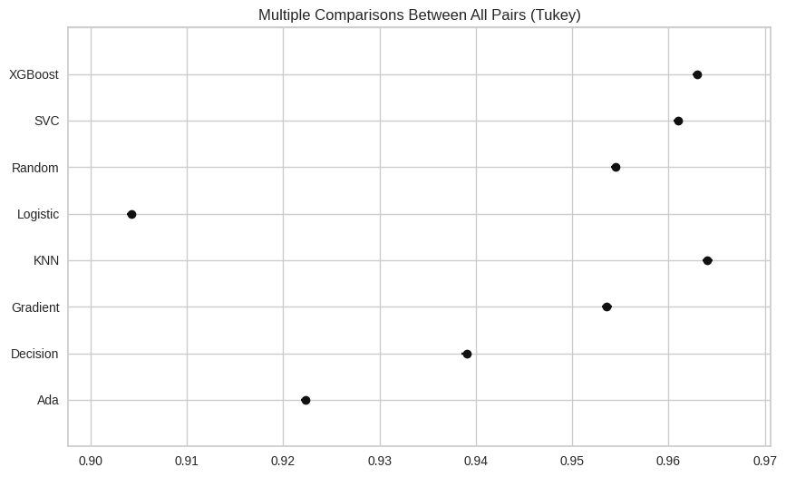
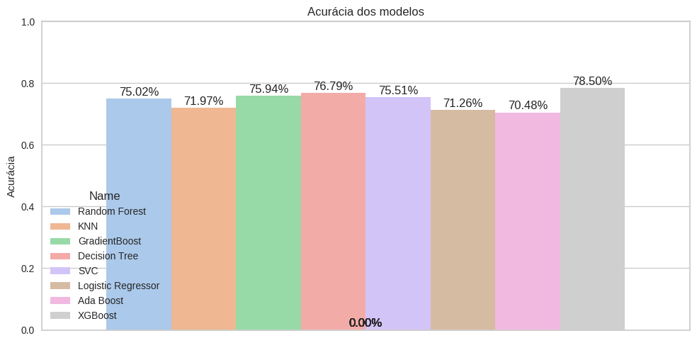
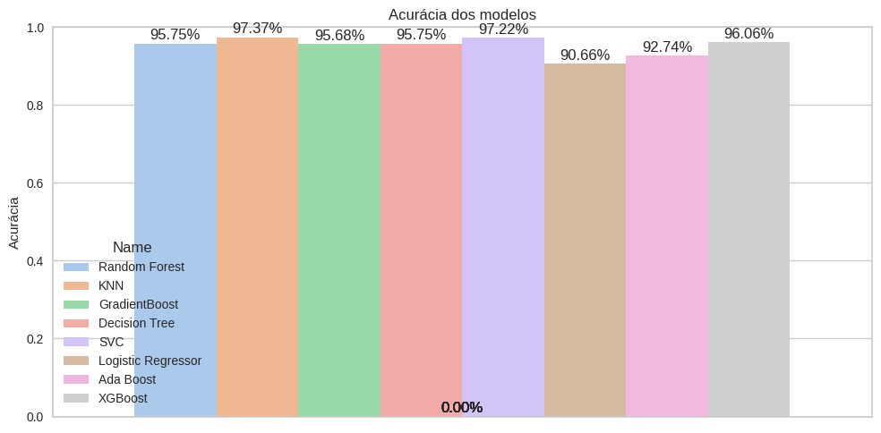

# 🏡 House Predictions - Predição de Churn

Este projeto tem como objetivo **prever churn** (saída de clientes) a partir de dados históricos, explorando diferentes modelos de Machine Learning e avaliando o impacto de pré-processamentos.

## 📌 Objetivos
- Realizar **análise exploratória de dados (EDA)** para entender os padrões relacionados ao churn.  
- Comparar o desempenho de diferentes modelos de Machine Learning.  
- Explorar os efeitos de **dados sem Smoteen e com Smoteen** nos resultados.  
- Aplicar **técnicas de otimização de hiperparâmetros** (GridSearch).  
- Avaliar os modelos com métricas estatísticas adequadas.  

---

## ⚙️ Tecnologias utilizadas
- Python 3.11  
- Pandas, NumPy  
- Matplotlib, Seaborn, Plotly  
- Scikit-learn  
- Statsmodels  
- Joblib  
- Yellowbrick
- Xgboost
- Kaggle
- Imbalanced-learn
- Warning
---

## 🧠 Modelos testados  
- **Random Forest Regressor**
- **KNN**
- **GradientBoost**
- **Decision Tree**
- **SVC**
- **Logistic Regressor**
- **Ada Boost**
- **XGBoost**

Com o uso de:
- **GridSearchCV** → Busca dos melhores parâmetros para os modelos
---

## 📊 Métricas utilizadas
Para comparar os modelos foram utilizadas métricas estatísticas clássicas de regressão:

- **MAE (Mean Absolute Error)** → erro médio absoluto.  
- **MSE (Mean Squared Error)** → erro quadrático médio.  
- **RMSE (Root Mean Squared Error)** → raiz do erro quadrático médio.  
- **Accuracy** → Precisão do modelo   

Além disso, foi utilizada a técnica **MultiComparison** (do Statsmodels) para avaliar estatisticamente as diferenças entre os modelos.

---

## 📈 Principais resultados
- A análise mostrou diferenças relevantes entre modelos quando lidamos com **dados crus** vs **dados com Smoteen**.  
- O **KNN** apresentou melhores resultados dentre os outros modelo em relação as métricas e pelo MultiComparison.  

- Porém quando analisados quanto a melhor precisão o gráfico gerado mostra outros resultados

- O teste foi feito também na base utilizando o resample do Smoteen

- Esses resultados foram gerados por modelos treinados com uma base de treino utilizando o resample do Smoteen pois ela gerou resultados melhores de treino
- do que a base original.
---

## 📂 Estrutura do projeto
```
📦 PredicaoDeChurn
 ┣ 📜 Main.ipynb        # Notebook principal com todo o pipeline
 ┣ 📜 requirements.txt  # Dependências do projeto
 ┣ 📜 README.md         # Documentação do projeto
 ┣ 📂 models/           # Modelos salvos do projeto
 ┣ 📂 graficos_matrizes_tabelas # Gráficos gerados do projeto      
 ┗ 📂 data/             # Dados utilizados 
```

---

## 💾 Salvando modelos
Os melhores modelos foram salvos utilizando **joblib**, permitindo reuso em produção.

```python
import joblib

# salvar modelo
joblib.dump(melhor_modelo, "models/modelo")

# carregar modelo
modelo = joblib.load("models/modelo")
```

---

## 🚀 Como executar
1. Clone este repositório:  
   ```bash
   git clone https://github.com/PedroHenriqueBRO/ChurnPrediction.git
   ou
   git clone git@github.com:PedroHenriqueBRO/ChurnPrediction.git
   cd PredicaoDeChurn
   ```
2. Crie um ambiente virtual e instale as dependências:  
   ```bash
   pip install -r requirements.txt
   ```
3. Abra o Jupyter Notebook e rode o `Main.ipynb`:  
   ```bash
   jupyter notebook
   ou em outra ferramenta (como o VSCode)
   ```

---

## 📌 Conclusão
Este projeto reforça práticas fundamentais em **Data Science**:  
- Pré-processamento e tratamento de dados.  
- Comparação estatística entre modelos.  
- Escolha de algoritmos baseados em resultados e complexidade.  
- Documentação e reprodutibilidade.  
